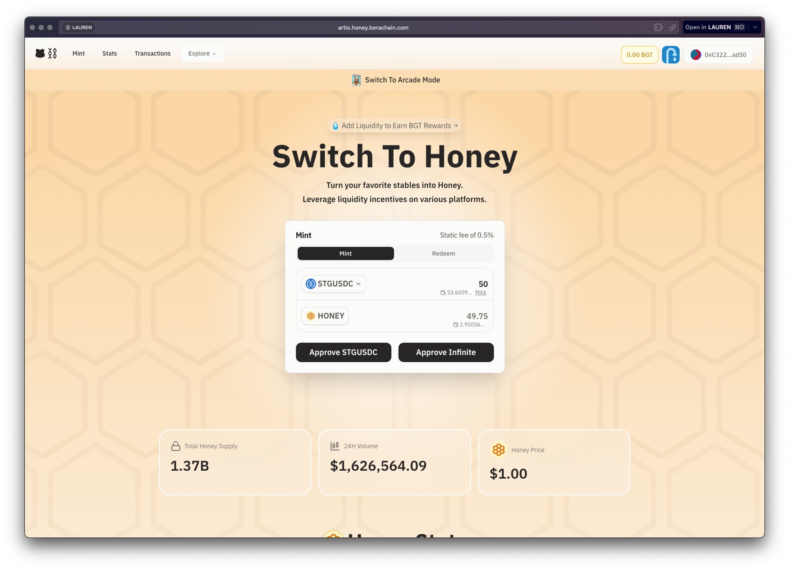

💡 **Troubleshooting Notes:** 
- Custom RPCs can be [created here](https://www.ankr.com/rpc/projects/) to make UX better as there is a lot of traffic on the network
- If you get an error when trying to swap or claim, avoid using the “max” shortcut and instead type in an amount using whole numbers or a max of 2 decimal places [h/t aibra](https://twitter.com/aibra/status/1763182775383773278)

### Phase 1: Collecting Native Currencies

*1. Get funds on the network*

- [Main Faucet](https://artio.faucet.berachain.com/) (.1BERA every 8 hours)
- [Quicknode Faucet](https://faucet.quicknode.com/berachain/artio) (.1BERA every 12 hours)
- [The Honey Jar Faucet](https://faucet.0xhoneyjar.xyz/) (need badges to be able to claim, up to 1 BERA every 24 hours)
- [Aori Faucet](https://app.aori.io/) (0.1 BERA every 8 hours)

*2. Get USDC on Bera*

- Go to [BEX](https://artio.bex.berachain.com/)
- Swap BERA → STGUSDC (swap ~35% to leave some for other swaps and gas)
    
	

*3. Acquire Honey [Native Stablecoin]*

- *OPTIONAL* [Do Galxe Quest](https://galxe.com/Berachain/campaign/GCjGGttCAG) [it didn’t work for me]
    
	
    
    - Onboarding Quest (follow accounts)
    - Daily Quest: Visit Honey dApp
	
- If Galxe isn’t working, skip straight to [Honey dApp](https://artio.honey.berachain.com/)

- Mint Honey with STGUSDC

        
	
        
		
- Swap BERA → wETH
    - This will allow you to have a little bit of BERA (for gas), Honey and wETH for pooling
    - Go back to the BEX and swap ~75% of the BERA you have left to leave a little for gas
        
		
	
        

This concludes the basic, recursive loop that can and should be repeated as you collect more BERA from faucets each day and slowly build up more wETH, Honey and STGUSDC to play with 

### Phase 2: Earning & Trading

- Now that you’ve acquired some base currency - you can start looking for places to compound what you have and also start getting paid incentives
- For this, you can use many different combinations of wETH, Honey, STGUSDC and in turn [earn BGT](https://docs.berachain.com/learn/protocol/bgt-emissions)

**Method 1:** Adding Liquidity/Creating Pools

- Head back to the BEX and either deposit into an existing pools or create a new one
        - I started small with two one asset Honey deposits just to get a feel but there are lots of pools to choose from

- **Method 2:** [Lending on BEND](https://artio.bend.berachain.com/dashboard)
    - You can add wETH or wBTC as collateral to borrow more HONEY, but I would wait on this until you have a better idea of what strategy you are actually taking with Honey if any before resorting to that.
    - I started by just supplying a small amount of Honey to earn interest (APY is like 0.07% so not really worth it but wanted to use BEND)
    - If you end up accruing enough wETH for free, it could be fine to deposit that, but again until you know what you are doing with Honey, there are probably better things to do
        

        
- **Method 3:** [Trading on BERPs](https://artio.berps.berachain.com/vault)
    - BERP allows you to bet on the price of BTC, ETH, Cosmos or Celestia using Honey, as well as acquire fees for staking Honey for bHoney which shares a split of trading fees from the platform
