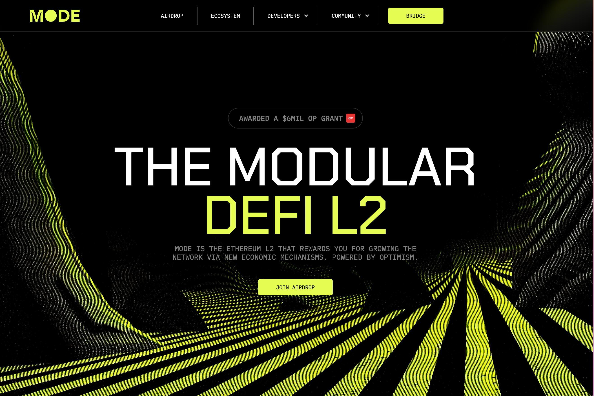

Start here: [https://ref.mode.network/YB5duY](https://ref.mode.network/YB5duY) 

You'll see what you already qualify for based on your wallet, then bridge some assets and start earning points by doing quests.

### PLAY WITH TESTNET

There are faucets here as well for the testnet, claim your testnet tokens:

- Smoothest: [https://www.l2faucet.com/mode](https://www.l2faucet.com/mode) /24 hrs
- [https://faucet.quicknode.com/ethereum/sepolia](https://faucet.quicknode.com/ethereum/sepolia)

With the Sepolia testnet ETH you are claiming from the faucets, move them over to MODE here: 

[https://bridge.mode.network/](https://bridge.mode.network/)

### BRIDGE TO MODE
Move assets from other chains to MODE:  [https://app.mode.network](https://app.mode.network/)

This is real money not testnet so it's going to cost you gas, supposed to be safe to even park some of your ETH here, calculate in the usual smart contract risks.
Bridge at least $100-200 for transactions and later tasks.

### PLAY WITH THE ECOSYSTEM

- [ ]  Joined Sunrise
- [ ]  Bridged from mainnet ([https://app.mode.network](https://app.mode.network/))
- [ ]  Register a Domain: around $50 [https://space.id](https://space.id/)
- [ ]  Swap on [https://app.kim.exchange/swap](https://app.kim.exchange/swap) since Mode is not ETH mainnet this will virtually be free
- [ ]  Swap on [https://supswap.xyz/](https://supswap.xyz/)
- [ ]  Deploying smart contracts: [https://minter.merkly.com/deploy/empty](https://minter.merkly.com/deploy/empty)

I am exploring the other ones if they are safe and fun and valuable to do.

### AIRDROP REWARDS

Here’s how to start earning points on Mode:

**Past Onchain Activity:** Earn points based on past activity across 150 protocols and projects from 6 key categories. All points can be viewed when connecting your wallet and can be claimed by bridging to Mode. The categories are:

- DeFi - users of DeFi apps
- NFT - holders of NFTs
- Scaling - users of Layer2s
- OG - users of OG DeFi apps like Maker, Curve, Yearn
- Degen - users of leverage apps
- Yield - apps that give users yield

**Bridge assets to Mode:** Bridging ETH, USDT, USDC, and WBTC to Mode using our bridge earns points relative to the time these assets remain on Mode. TVL is checked and points are distributed on a weekly basis.

**Invite friends to Mode:** When you invite friends you will earn 16% of the points they collect during the campaign. For example if your friend earns 100,000 points you will earn 16,000. You can invite multiple friends to Mode. In addition, you will also earn a share of Sequencer Fees for people you refer to Mode from the onchain referral mechanic (this will be live in early Feb).

‍**Use ecosystem apps:** You get higher points for depositing assets into launch partner ecosystem apps. In addition, you earn points for transactions on Mode. Please note using ecosystem apps is at your own risk.

‍**Coming soon - Complete quests:** There are boosted points for completed quests. Go to the Quests tab and check out the latest quest. Points will be earned when quests are completed. Please note that quests will be limited in capacity.

### Timeline

**Phase 1 - Mode Sunrise -** Now to AprilYou can access mode sunrise see your score and earn points by bridging to mode, inviting friends and using ecosystem apps.

**Phase 2 - DeFi ecosystem and Native Yield -** Feb/ marchDefi ecosystem applications and native yield launches on Mode.

**Phase 3 - Token launch -** AprilMode dao will launch. Points will be converted to mode tokens and distributed.
